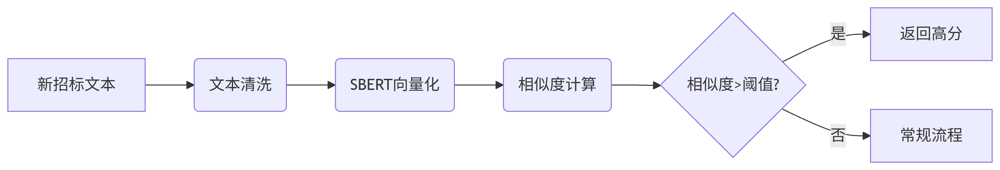

**项目背景**
基于中国公示的招标公式来建立一种推荐模型，自动推荐出与公示内容相关的招标讯息,通过NLP技术.将公示内容进行分词，然后通过关键词匹配，推荐出与公示内容相关的招标讯息。

原始数据-特征筛选-特征工程(筛选，分词)-建设两个语料库：相关度（正/反），商业潜力(正/反)

标注完成后文本输入BERT模型来得出两个评分，相关度评分和商业潜力评分。然后计算MSE，利用梯地下降法不断提升模型性能

标注工作：
主要标注业务相关度，高中低，和商业潜力高中低，用1低2中3高代替
graph TD
    A[原始文本] --> B{是否含核心业务词？}
    B -->|是| C[标注相关度]
    B -->|否| D{是否建筑类项目？}
    D -->|是| E[标注潜力值]
    D -->|否| F[标记为无关]
flowchart TD
    A[标注完成] --> B{是否存在？
       业务高相关但潜力为D
       业务低相关但潜力为S}
    B -->|是| C[触发人工复核]
    B -->|否| D[通过校验]

**项目目标**:
1. 通过NLP技术,将公示内容进行分词,然后通过关键词匹配,推荐出与公示内容相关的招标讯息。
2. 分析公司过往的中标讯息,建立一个转有的词典,然后通过关键词匹配,推荐出与公示内容相关的招标讯息。
3. 建立有效的pipeline, 运用爬虫技术或者直接调用剑鱼的API接口,封装所有标讯处理函数以便后续使用。

